# 🏳️‍🌈 The Load Down

> **The gayest, most fabulous way to track your romantic adventures** ✨
> Privacy-first analytics for your dating life, hookups, and social connections - because data is beautiful, darling! 💅

---

## ⚠️ 🤖 **CRITICAL: AI-DEVELOPED APPLICATION** 🤖 ⚠️

### 🚨 **READ THIS BEFORE USING** 🚨

**This entire application was developed using GitHub Copilot and other AI assistance.** While functional and extensively tested, **users should be aware of the inherent risks:**

#### **Development Details:**
- **🤖 100% AI-Written Code**: Every component, function, and feature generated with AI assistance
- **🔄 Multiple Iterations**: 150+ development sessions with continuous refinement
- **🧪 Extensive Testing**: Manual testing, security audits, and edge case validation
- **📝 Code Reviews**: Human oversight and validation of AI-generated code
- **🛠️ Real-World Usage**: Active development and feature testing over several months

#### **⚠️ Expected Risks & Limitations:**
- **🐛 Bugs Are Expected**: AI-generated code may contain subtle logic errors
- **🔐 Security Concerns**: Encryption/security implementations need expert review
- **💾 Data Integrity**: Backup your data frequently - corruption possible
- **🌐 Browser Compatibility**: May not work perfectly across all browsers/devices
- **📱 Mobile Issues**: PWA features may have platform-specific bugs
- **🔄 Update Risks**: New AI-generated features may introduce regressions

#### **🛡️ Safety Recommendations:**
- **💾 Regular Backups**: Use both local export AND Azure cloud backup
- **🔍 Verify Critical Functions**: Double-check important data operations
- **🧪 Test New Features**: Try features in demo mode first when possible
- **📱 Multiple Devices**: Don't rely on single-device storage
- **🔒 Review Security**: Consider security audit if handling sensitive data

**By using this app, you acknowledge these AI development risks and agree to backup your data regularly.**

---

## 💖 About The Load Down

Let's be real, bestie - we're living our best lives out here, meeting amazing people, having incredible experiences, and creating memories that deserve to be tracked with the same precision we use for our skincare routines! 🌟

**The Load Down** isn't just another boring relationship tracker - it's your personal relationship analytics dashboard that celebrates every connection, every encounter, and every fabulous moment of your social life. Whether you're dating, hooking up, making friends, or just living your truth, this app has got your back (and your front, and your... well, you get it) 😉

### 🌈 Why "The Load Down"?

Because we're getting the FULL tea on your romantic life, honey! 🍵✨

- **"Load"** = All the juicy details, the complete story, the full download
- **"Down"** = The real scoop, the lowdown, the honest truth about your connections
- **Together** = Your comprehensive relationship intel, served with style and zero judgment

We're here for all the drama, all the romance, all the late-night adventures, and yes - all the intimate moments too. This app celebrates the full spectrum of human connection with the respect, privacy, and fabulousness it deserves! 🎭💫

## ✨ What This Fabulous App Does

- **👥 Your Personal Roster**: Gorgeous contact profiles with photos - like Tinder but for people you've actually met!
- **📝 Encounter Chronicles**: Rate your dates, hookups, and hangouts from ⭐ to ⭐⭐⭐⭐⭐ with all the tea 🍵
- **📊 Analytics That Serve**: Dashboard insights that would make a data scientist weep with joy 📈✨
- **🔍 Smart Search**: Find that cute barista from Tuesday faster than you can say "bottom energy"
- **☁️ Azure Backup**: Enterprise-grade cloud storage (because your data deserves luxury treatment)
- **🔒 Fort Knox Security**: Locked tighter than your DMs - Face ID, PIN, military encryption! 🛡️

## � See It In Action (Screenshots)

*Because seeing is believing, and this app is absolutely gorgeous!* ✨

### 🏠 Your Fabulous Dashboard
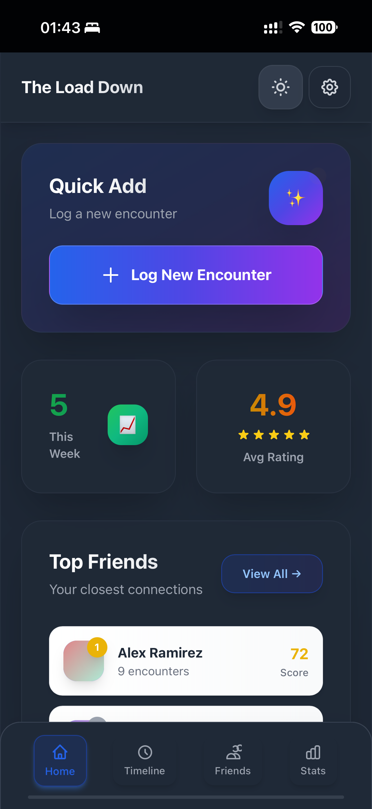

*Clean, modern interface with glass morphism effects and instant insights*

### 👥 Comprehensive Contact Management

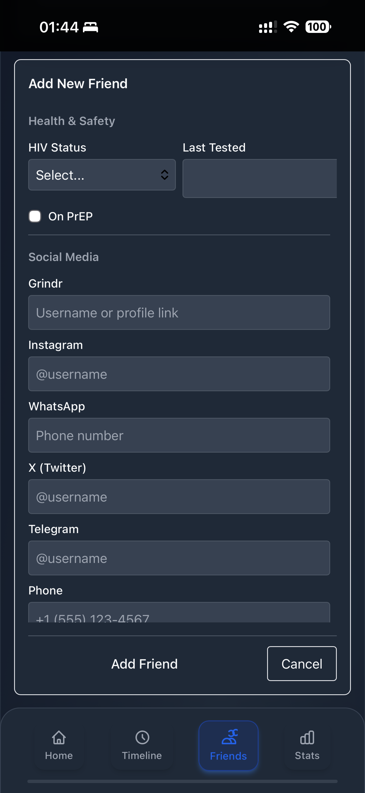
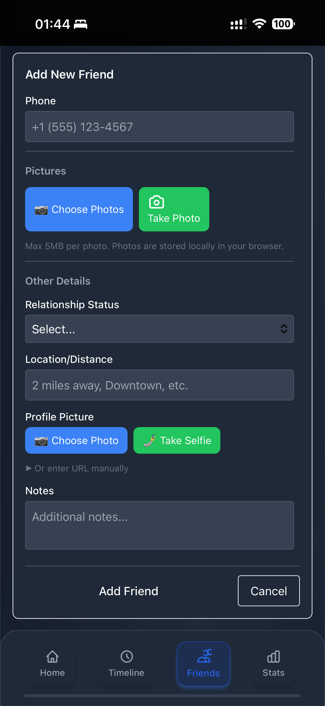

*From basic info to sexual preferences - track everything that matters with style*

### 📝 Encounter Logging That's Actually Fun
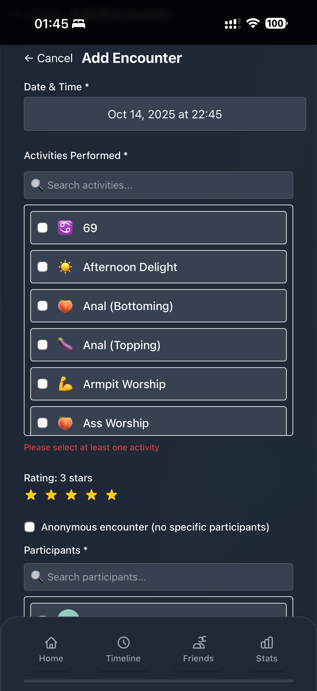
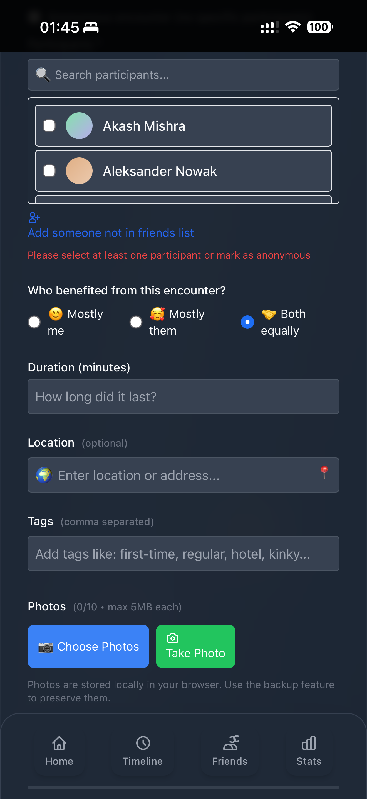

*13+ activity types, ratings, duration, location - capture every detail with discretion*

### 📊 Analytics That Would Make Data Scientists Weep
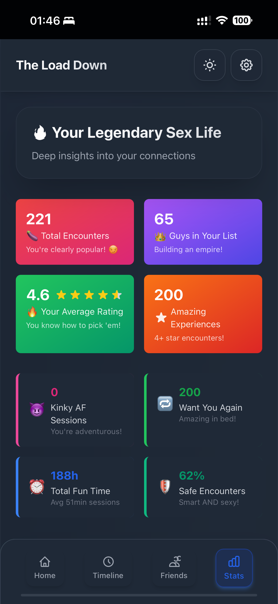
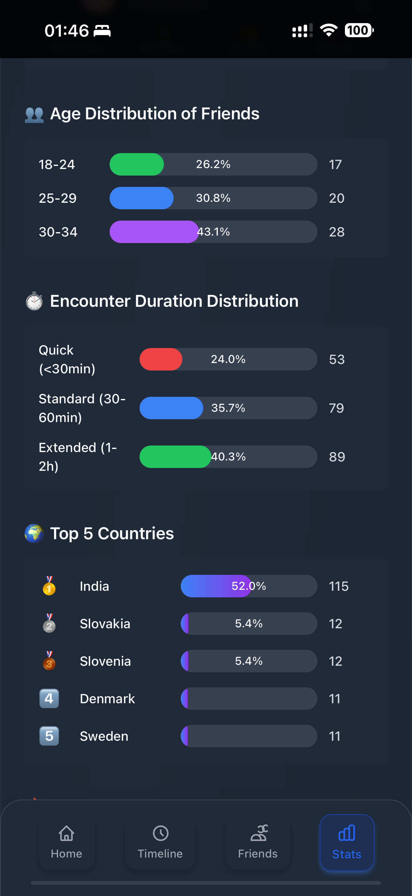
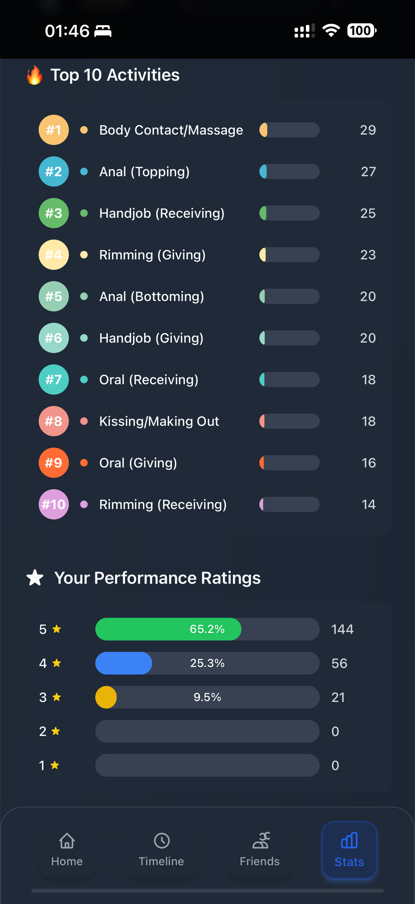
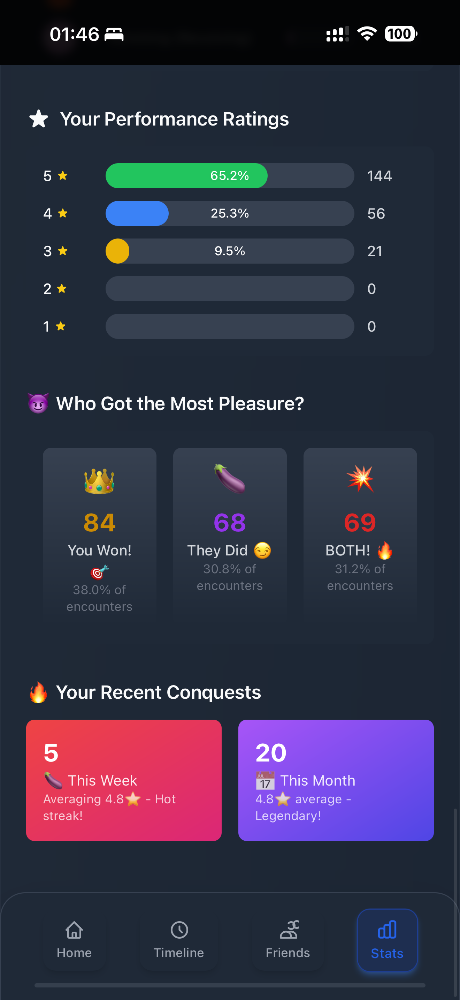

*From performance ratings to geographic hotspots - insights that actually matter*

### 🗺️ Timeline & Geographic Intelligence
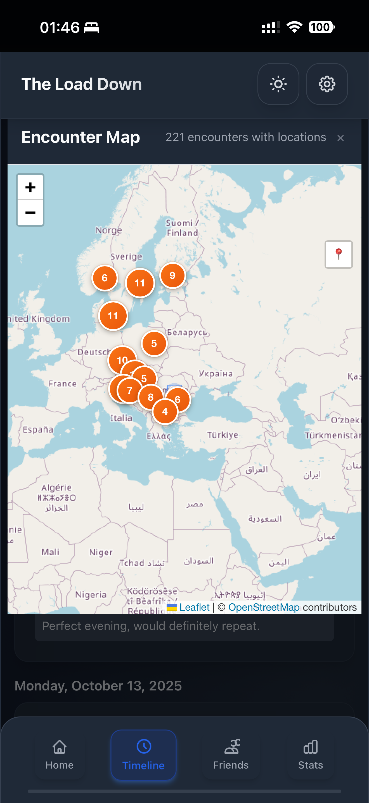
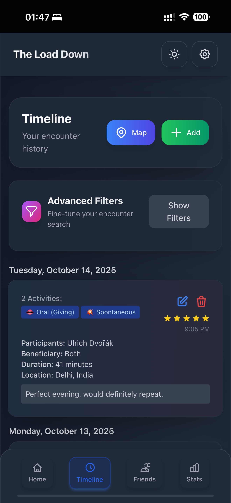

*See where the magic happens with beautiful mapping and chronological views*

### 🔒 Privacy & Security That Actually Protects
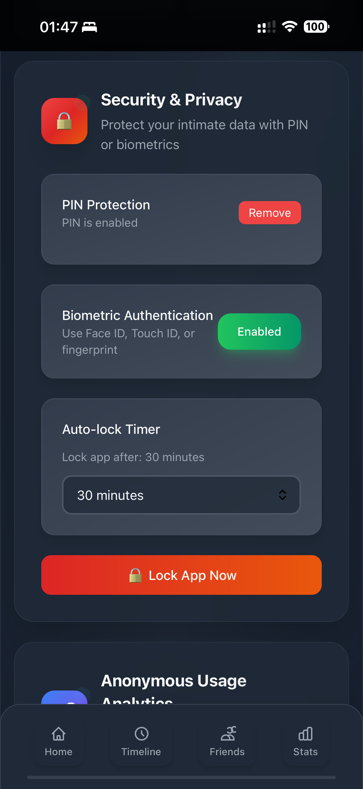
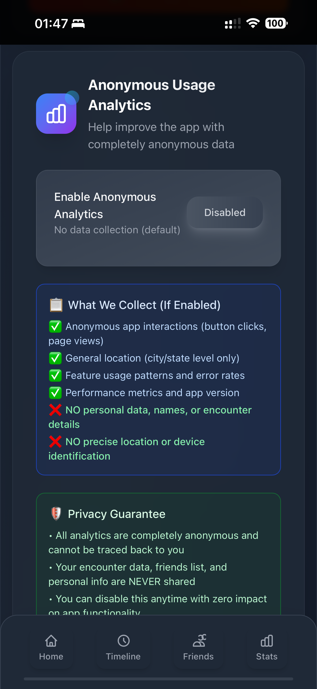
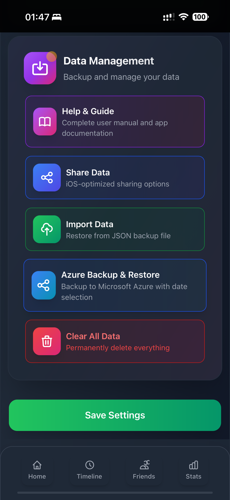

*Military-grade encryption, biometric locks, and complete data control*

## �📈 What You Can Track (The Full Menu, Honey!)

### 💅 Your Personal Analytics Empire
- **The Ranking System**: Who's bringing the most joy to your life? Our algorithm knows! 👑
- **Pattern Recognition**: Discover your type, your timing, your favorite spots for romance 🗺️
- **Stats That Matter**: Age ranges, duration analysis, geographic hotspots - it's like Spotify Wrapped but for your love life! 🎵
- **Performance Insights**: Track which connections are thriving and which need more attention 📊

### 🌟 Every Juicy Detail
- **13+ Encounter Types**: Coffee dates ☕, dinner dates 🍽️, hookups 🔥, deep conversations 💭, and yes... *those* encounters too 😏
- **5-Star Rating System**: From "meh" ⭐ to "life-changing" ⭐⭐⭐⭐⭐ with space for ALL the details
- **Location Magic**: Remember where the magic happened - from cozy cafés to that one rooftop bar 📍
- **Time & Duration**: How long did that coffee "date" *really* last? We're keeping receipts! ⏰

## 🛡️ Our Sacred Vows (Privacy Philosophy)

### 🤐 Your Secrets Are Safe With Us
- **Zero Snooping**: We don't collect, track, or peek at ANYTHING - pinky promise! 🤞
- **Local Royalty**: Your data lives on YOUR device like the queen it is 👑
- **No Sign-Ups**: No email, no passwords, no "verify your identity" nonsense 🚫
- **Offline Fabulous**: Works without WiFi because great connections happen everywhere! 📶

### 🔐 Discretion is Our Middle Name
- **Military-Grade Locks**: AES-256 encryption that even the NSA would respect 🎖️
- **Biometric Glamour**: Face ID, Touch ID - unlock with style! ✨
- **Auto-Lock Magic**: Configurable timeouts so your secrets stay secret 🔒
- **Anonymous AF**: We don't know you, we don't want to know you, we just want you to thrive! 💅

*Because your business is YOUR business, and we're just here to help you organize it fabulously!* 🌈

---

## 📚 Ready to Dive Deeper, Darling?

Want the FULL tutorial, complete setup guides, and all the advanced features? We've got you covered with our absolutely *gorgeous* documentation wiki! ✨

### **🌈 [Your Fabulous Wiki Awaits!](https://github.com/xenum72-del/bbb/wiki)**

#### 🚀 Get Started Like a Pro
- **[📱 Installation Magic](https://github.com/xenum72-del/bbb/wiki/Installation)** - iPhone PWA setup that actually works (we promise!)
- **[🎯 First Steps](https://github.com/xenum72-del/bbb/wiki/Getting-Started)** - From zero to relationship analytics hero
- **[🔐 Lock It Down](https://github.com/xenum72-del/bbb/wiki/Security)** - Security setup that would make Apple jealous

#### ☁️ Level Up Your Game
- **[🏢 Azure Backup Boss Mode](https://github.com/xenum72-del/bbb/wiki/Azure-Backup)** - Enterprise cloud backup for your love life
- **[📱 Device Switching](https://github.com/xenum72-del/bbb/wiki/Device-Migration)** - Moving your data like a digital nomad queen

#### 🎭 Secret Features & Fun Stuff
- **[🔧 Developer Mode](https://github.com/xenum72-del/bbb/wiki/Developer-Mode)** - Hidden features that'll blow your mind (7-tap activation!)
- **[🎲 Sample Data Playground](https://github.com/xenum72-del/bbb/wiki/Sample-Data)** - 221 fake encounters + 65 fake friends for testing
- **[🆘 When Things Go Wrong](https://github.com/xenum72-del/bbb/wiki/FAQ)** - Troubleshooting with style and sass

---

## 🛠️ Technical Stack

**React 18** • **TypeScript** • **Vite** • **Tailwind CSS** • **Dexie.js** • **Progressive Web App**

---

## ⚖️ Legal & Ethics (The Fine Print, Darling)

- **18+ Only**: This is grown folks business, honey! 🔞
- **Consent is King**: Only track consensual encounters - no stalker behavior allowed! 👑
- **Respect Privacy**: Don't share others' tea without permission - that's just rude ☕
- **MIT License**: Free, open source, and fabulous forever! 🌈

## 🆘 Need Help? We've Got You!

- **📚 [Gorgeous Wiki Docs](https://github.com/xenum72-del/bbb/wiki)** - Everything you need to know, served with sass
- **🐛 [Bug Reports](https://github.com/xenum72-del/bbb/issues)** - Tell us what's broken (nicely please!)
- **💻 [Source Code](https://github.com/xenum72-del/bbb/)** - For the technically curious queens
- **🛡️ [Security Dashboard](https://xenum72-del.github.io/bbb/security-dashboard/)** - Security and behavioral continous tests of the app code.
---

*Built with ❤️, ✨ glitter, 🏳️‍🌈 pride, and TypeScript.*
*Privacy-first, always. Judgement-free, forever.* 💅💖
